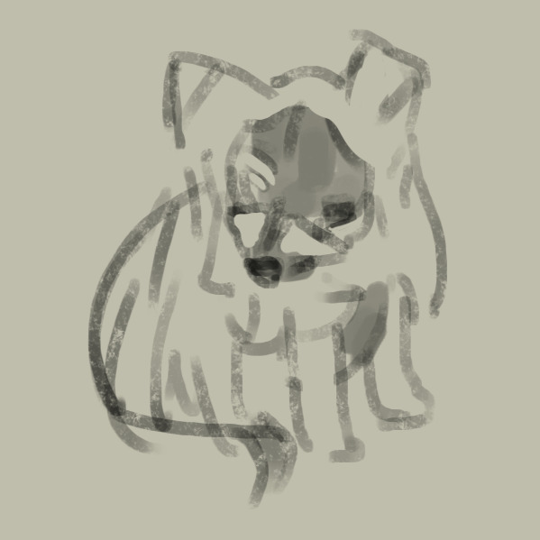

# flitch


*Logo by [twitter.com/haggle](https://twitter.com/haggle)*

A cute test harness that barks at you. Extremely minimal. WIP.

```js
import { test, not, only, run } from 'flitch';
import { strict as assert } from 'assert';

let sum = 0;

test('addition works', () => {
  sum += 10;
  assert.equals(sum, 10); // use whatever assertion library you want
  return () => sum = 0; // cleans up after test is complete
});

not('this test will be skipped', () => {
  sum += 20;
  assert.equals(sum, 21); // this would fail, but we're skipping this test! *shrugs*
});

only('this test will run, by itself! the first two tests are ignored', async () => {
  // async test are cool!
  sum = await Promise.resolve(50);
  assert.equals(sum, 50);
});
```

## Credits
Inspired by [fantestic](https://github.com/porsager/fantestic).